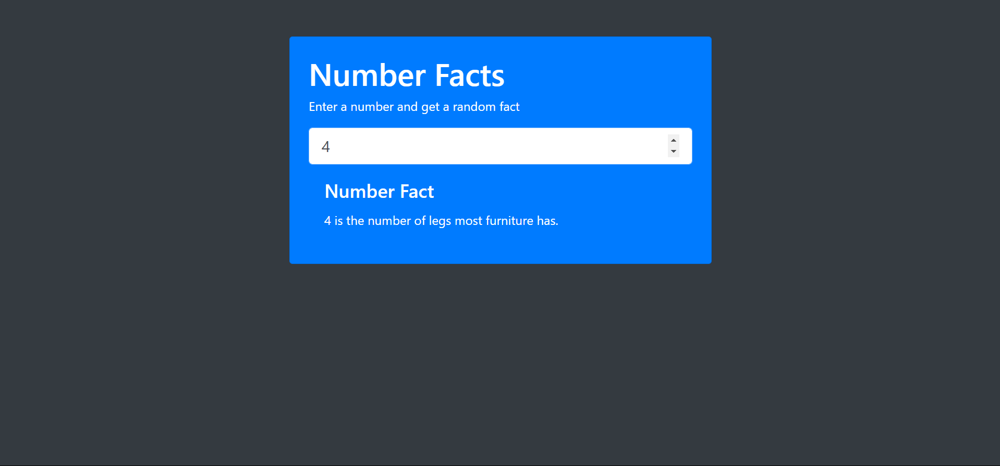

# Facts App

This app provides interesting facts based on the number input by the user. It utilizes HTML, CSS, JavaScript, and the Numbers API to fetch and display the facts.

## Features
-Enter a number to get a fact related to that number.

-Supports facts for various categories including math, trivia, date, and year.

-Simple and clean user interface.

## Technology Used
-HTML

-JavaScript
